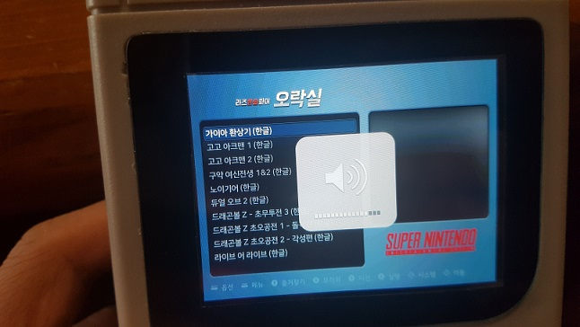
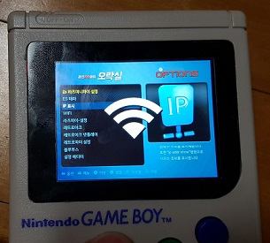
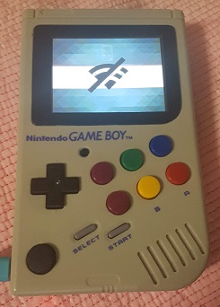

# VolumeJoy
Volume & Wifi control with Joystick for RetroPie

## Install
<pre><code>
cd ~
git clone https://github.com/amos42/VolumeJoy
cd VolumeJoy
sudo chmod +x ./install.sh
sudo ./install.sh
</code></pre>

### Install on Console  
 

### Change Volume  
 

### Wifi On  
 

### Wifi Off  
 
